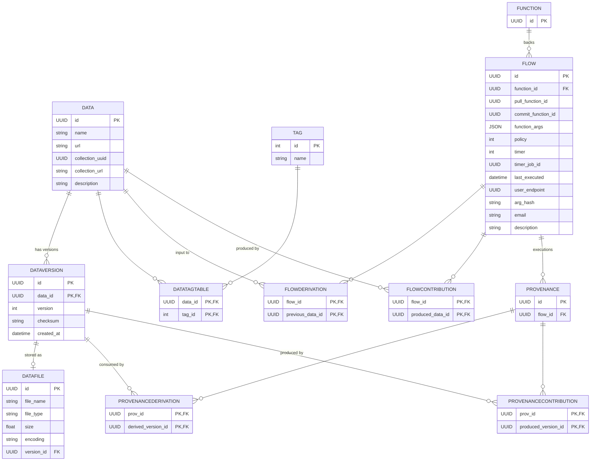

# AERO Database Schema

All tables live in the `aero-schema` Postgres schema, defined as SQLModel classes under `aero/models/`. There are seven entity tables and five association tables.

## Entity tables

### `data` — logical dataset, the hub of everything

| Column | Type | Notes |
|---|---|---|
| `id` | UUID | PK, default `uuid4()` |
| `name` | str | required |
| `url` | str? | source URL |
| `collection_uuid` | UUID? | Globus Connect Server collection |
| `collection_url` | str? | base URL on that collection |
| `description` | str? | free text |

### `dataversion` — versioned snapshot of a Data (`data_version.py:21`)

| Column | Type | Notes |
|---|---|---|
| `id` | UUID | PK component, default `uuid4()` |
| `data_id` | UUID | PK component, FK → `data.id` |
| `version` | int? | monotonic, indexed |
| `checksum` | str? | used to dedupe new uploads |
| `created_at` | datetime | default `now()` |

Composite primary key `(id, data_id)` — slightly unusual since `id` is already unique; the `data_id` half makes the FK relationships explicit.

### `datafile` — physical artifact backing a DataVersion (`data_file.py:17`)

| Column | Type | Notes |
|---|---|---|
| `id` | UUID | PK |
| `file_name` | str | required |
| `file_type` | str? | extension/MIME |
| `size` | float | required (Numeric) |
| `encoding` | str | default `"utf-8"` |
| `version_id` | UUID | FK → `dataversion.id` |

### `flow` — registered automation (`flows.py:54`)

| Column | Type | Notes |
|---|---|---|
| `id` | UUID | PK |
| `function_id` | UUID? | FK → `function.id` (main compute fn) |
| `pull_function_id` | UUID? | downloader fn, required |
| `commit_function_id` | UUID? | result-commit fn, required |
| `function_args` | JSON | dict or list of task invocations |
| `policy` | int | `TriggerEnum` (-1 NONE, 0 INGESTION, 1 TIMER, 2 ANY_INPUT, 3 ALL_INPUT) |
| `timer` | int? | seconds between firings |
| `timer_job_id` | UUID? | Globus Timer job handle |
| `last_executed` | datetime? | used by ANY/ALL_INPUT logic |
| `user_endpoint` | UUID? | Globus Compute endpoint |
| `arg_hash` | str? | md5 used to dedupe registrations |
| `email` | str? | failure notifications |
| `description` | str? | |

### `function` — Globus Compute function reference (`function.py:15`)

| Column | Type | Notes |
|---|---|---|
| `id` | UUID | PK — the Globus Compute function UUID |

Intentionally minimal; one Function can back many Flows.

### `provenance` — single flow execution (`provenance.py:35`)

| Column | Type | Notes |
|---|---|---|
| `id` | UUID | PK |
| `flow_id` | UUID | FK → `flow.id` |

### `tag` — discovery label (`tag.py:23`)

| Column | Type | Notes |
|---|---|---|
| `id` | int | PK (auto-increment) — note: integer here, every other PK is a UUID |
| `name` | str | |

## Association tables

| Table | Columns | Joins |
|---|---|---|
| `datatagtable` | `(data_id, tag_id)` | Data ↔ Tag |
| `flowderivation` | `(flow_id, previous_data_id)` | Flow → input Data (whole dataset, not a specific version) |
| `flowcontribution` | `(flow_id, produced_data_id)` | Flow → output Data |
| `provenancederivation` | `(prov_id, derived_version_id)` | Provenance → input DataVersion |
| `provenancecontribution` | `(prov_id, produced_version_id)` | Provenance → output DataVersion |

The asymmetry is deliberate: a **Flow** declares dependencies at the *Data* level (it doesn't know in advance which version will trigger it), while a **Provenance** record pins the exact *DataVersion* IDs that actually went in and came out of one run.

## Schema diagram

## How the rows flow at runtime

1. **Registration** writes `data`, `function`, `flow`, plus `flowderivation`/`flowcontribution` rows. If `timer` is set, a `timer_job_id` is filled in after Globus Timer responds.
2. **Upload** (`Data.add_new_version`) inserts a `dataversion` + `datafile`, checking `checksum` against the latest version to dedupe.
3. **Execution callback** (`POST /prov/new`) inserts output `dataversion`/`datafile` rows, then one `provenance` row plus `provenancederivation`/`provenancecontribution` rows pinning the exact input and output versions.
4. **Chaining**: `Data.rerun_flow()` selects every Flow whose `flowderivation.previous_data_id` matches the freshly-updated Data and calls `Flow._run_flow()`, which uses `policy` + `last_executed` vs. each input's newest `dataversion.created_at` to decide whether to fire again.

## Schema quirks worth knowing

- `dataversion` has a composite PK `(id, data_id)` even though `id` is already `unique=True`. Likely intentional to make the relationship visible at the schema level, but it means joins to `dataversion` from `datafile.version_id` only reference `id`, not the full PK.
- `tag.id` is an `int` while everything else uses UUID — Tag rows are seedable and likely meant to be small/enumerable.
- `flow.function_args` is `JSON`. `create_flow` rewrites it into a `{kwargs, function, endpoint}` task envelope before insert, so reads from the DB get the already-wrapped form, not the user's raw input.
- `flow_derivation` points at Data (dataset granularity), `provenance_derivation` points at DataVersion (specific snapshot). Together they answer two different questions: "what could trigger this flow?" vs. "what actually fed this run?".
- There is no users table — identity is delegated to Globus Auth; `flow.email` is the only user-identifying column persisted.
